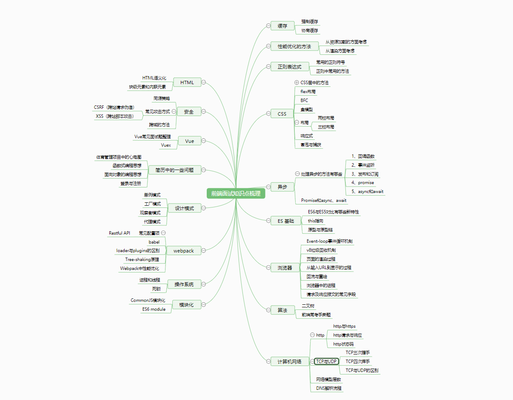

## Key knowledge of front-end interview

前端面试知识点梳理

### HTML

- HTML前端语义化
- 块级元素和内联元素

### CSS

- CSS居中的方法
  - 垂直居中
  - 水平居中
- flex布局
- BFC
- 盒模型
- 布局
  - 两栏布局
  - 三栏布局
- 响应式
- 冒泡与捕获

### ES语法基础

- ES6新特性
- this指向问题
- 箭头函数
- 原型与原型链
- 浅拷贝与深拷贝
- 循环遍历的方式
- 继承
- 闭包
- Ajax

### 浏览器

- Event-loop事件循环机制
- V8引擎垃圾回收机制
- 页面的渲染过程
- 从输入URL到显示的过程
- 回流与重绘
- 浏览器中的进程
- 请求与响应报文报文中常见字段
- 浏览器发送请求的方式

### 异步

- 处理异步有哪些方法
- Promise和async、await

### 缓存

- 强制缓存
- 协商缓存

### 性能优化的方法

- 从资源加载的方面考虑
- 从页面渲染方面考虑
- Webpack中常见的性能优化方法

### 模块化

- CommonJS 模块化
- ES6 module模块化

### 设计模式

- 单例模式
- 工厂模式
- 观察者模式
- 代理模式

### 正则表达式

- 常见的正则表达式符号
- Js中使用正则常用的方法

### 安全

- 同源策略
- 常见的攻击方式及防护
  - XSS
  - CSRF
- 跨域的方法

### Vue

- Vue常见面试题
  - Vue的响应式系统（即双向绑定）
  - 介绍一下Vue的生命周期
  - computed与watch的区别
  - 为什么组件的data必须是一个函数
  - 组件之间通信的方式有哪些
  - Vue事件绑定原理说一下
  - slot是什么？有什么作用？原理是什么？
  - Vue模板渲染的原理是什么？
  - template预编译是什么？
  - template和JSX有什么区别？
  - 说一下虚拟DOM
  - 介绍一下Vue中的diff算法
  - key属性的作用是什么？
  - 说说Vue2.0和Vue3.0有什么区别？
  - 为什么要新增Composition API，它能解决什么问题？
  - 都说Composition API与React Hook很像，说说区别？
  - SSR有了解吗？原理是什么？
  - v-show和v-if的区别
  - vue中路由的两种实现方式
- Vuex的原理

### 计算机网络

- http
  - http各版本特点和https
  - http请求与响应
  - http状态码
- TCP与UDP
  - TCP三次握手过程及原因
  - TCP四次挥手过程及原因
  - TCP与UDP的区别

### 操作系统

- 进程和线程

- 死锁

### 简历中存在的一些问题

- 体育管理项目中的心电图实现
- 登录与注册
- 函数式编程思想
- 面向对象编程思想

### 算法

- 前端常考手撕题
  - 手写防抖
  - 手写节流
  - 手写Call、apply、bind
  - 手写深拷贝
  - 手写flat
  - Promise.all
  - .......
- 二叉树
  - 满二叉树
  - 完全二叉树
  - 平衡二叉树
  - 搜索二叉树

