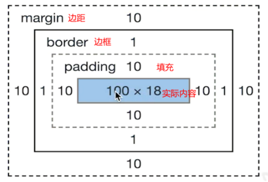

### 一、CSS中居中的方法

1. 水平居中

   1. inline元素：text-align:center； 
   2. block元素：margin:auto；
   3. absolute元素：left:50% + margin-left 负值；

2. 垂直居中

   1. inline元素：line-height的值等于height值；

   2. absolute元素：top:50% + margin-top负值；

   3. absolute元素：transform : translate(-50%,-50%)；

   4. 使用dispaly:flex弹性盒子，让主轴和交叉轴都居中

      > body {     
      >
      > ​	 display: flex;     
      >
      > ​	 justify-content: center;      
      >
      > ​	 align-items: center;    
      >
      > } 

   5. 使用diaplsy：table

      ```js
      display:table //使块状元素成为一个块级表格
      display:table-cell; //子元素设置成表格单元格
      vertical-align:middle; //使表格内容居中显示
      ```
   
3. absolute和relative分别依据什么定位？

   - relative 依据自身定位；
   - absolute依据最近的一层元素定位： 定位元素，先找absolute relative fixed来定位，如果没有再找body；

### 二、flex布局

##### （1）基础知识

1. flex-direction，属性决定主轴的方向（即项目的排列方向）；
2. flex-wrap属性定义，如果一条轴线排不下，如何换行；
3. flex-flow属性是flex-direction属性和flex-wrap属性的简写形式，默认值为row nowrap；
4. justify-content属性定义了项目在主轴上的对齐方式；
5. align-items属性定义项目在交叉轴上如何对齐；
6. align-content属性定义了多根轴线的对齐方式。如果项目只有一根轴线，该属性不起作用；

### 三、块级上下文

BFC即块级格式化上下文，它是一个独立的块级渲染容器，拥有自己的渲染规则，不受外部影响，不影响外部特征。

**（1）常见用法：**

1. 清除浮动

   ```js
   .bfc {
       overflow:hidden;/*触发元素 BFC*/
   }
   ```

2. 垂直外边距重叠问题

3. 自适用两列布局（`float + overflow`）

**（2）形成条件**

- float不是none
- position是absolute或fixed
- overflow不是visible 
- display是flex inline- block等

### 四、盒模型

​	offsetWidth = (内容宽度+内边距+边框)，无外边距



1. CSS盒模型本质上是一个盒子，封装周围的HTML元素，它包括：边距，边框，填充，和实际内容。
2. 允许我们在其它元素和周围元素边框之间的空间放置元素。
3. offsetWidth = (内容宽度+内边距+边框)，无外边距

### 五、CSS选择器优先级

##### （1）CSS的三大特性：继承、优先级和层叠

- **继承：**即子类元素继承父类的样式;
- **优先级：**是指不同类别样式的权重比较;
- **层叠：**是说当数量相同时，通过层叠(后者覆盖前者)的样式。

##### （2）css优先级

1. 不同级别下：

    **总结排序：!important > 行内样式>ID选择器 > 类选择器 > 标签 > 通配符 > 继承 > 浏览器默认属性**

2. 同一级别下：

   同一级别中后写的会覆盖先写的样式

### 六、手写clearfix

```js
.clearfix:after{
    content:'';
    display:table;
    clear:both;
}
.clearfix{
    *zoom:1; /*兼容IE低版本*/
}
```

### 七、absolute和relative分别依据什么定位？


### 七、响应式


### 八、两栏布局

​	两栏布局(左侧固定宽度，右侧自适应)

```js
<div class="wrap">
    <div class="left">
        左侧固定内容
    </div>
    <div class="right">
        右侧内容自适应
    </div>
</div>
```


### 九、三栏布局

> 三栏布局，中间一栏最先加载和渲染（内容最重要）
>
> 两侧内容固定，中间内容随着宽度自适应
>
> 一般用于PC端

实现原理：

- 使用float布局
- 两侧使用margin负值，以便和中间内容横向重叠
- 防止中间内容被两侧覆盖，一个使用padding一个用margin

**（1）圣杯布局**

```js
<style>
#center {
    float: left;
    width: 100%;
    /*左栏上去到第一行*/
    height: 100px;
    background: blue;
}
#left {
    float: left;
    width: 180px;
    height: 100px;
    margin-left: -100%;
    background: #0c9;
}
#right {
    float: left;
    width: 200px;
    height: 100px;
    margin-left: -200px;
    background: #0c9;
}
/*给内部div添加margin，把内容放到中间栏，其实整个背景还是100%*/
#inside {
    margin: 0 200px 0 180px;
    height: 100px;
}
</style>
<body>
    <div id="center">
        <div id="inside">middle</div>
    </div>
    <div id="left">left</div>
    <div id="right">right</div>
</body>
```

**（2）双飞翼布局**

```js
<style>
#bd{
    padding: 0 200px 0 180px;
    height: 100px;
}
#middle{
    float: left;
    width: 100%;
    height: 500px;
    background:blue;
}
#left{
    float:left;
    width:180px;
    height:500px;
    margin-left:-100%;
    background: #0c9;
    position: relative;
    left: -180px;
}
#right{
    float: left;
    width: 200px;
    height: 500px;
    margin-left: -200px;
    background: #0c9;
    position: relative;
    right: -200px;
}
</style>
<body>
    <div id="bd">
        <div id="middle">middle</div>
        <div id="left">left</div>
        <div id="right">right</div>
    </div>
</body>
```

