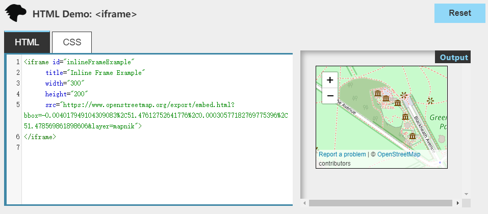
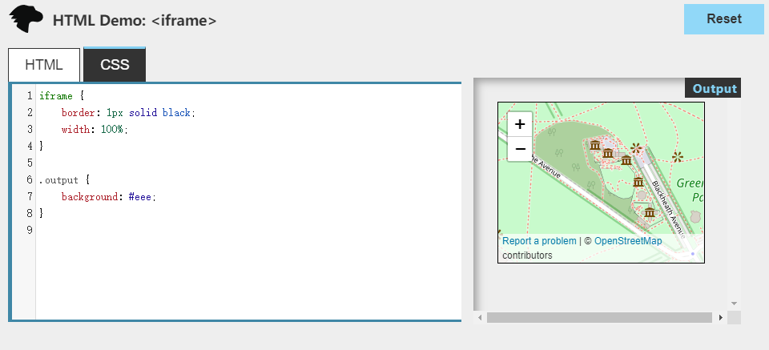

### 如何理解HTML语义化？

​	HTML前端语义化：就比如我们在写html代码的时候，该用div标签的时候用div标签，该用h标签的时候用h标签，该使用li标签的时候用li标签；不要全用div标签去嵌套实现。HTML语义化的好处就是：

- 让人更容易读懂（增加代码的可读性）
- 让搜索引擎更容易读懂


### 哪些是块级元素哪些是内联元素？

块级元素(display:block/table)：

- div
- h1
- h2
- table
- ul
- ol
- p

内联元素(display:inline/inline-block):

- span 
- img
- input
- button

### Js中事件绑定addEventListener和普通事件绑定有什么区别？

1. onclick写法是DOM0级规范，addEventListener是DOM2标准中定义的方法。

2. 普通事件绑定（onclick事件）在同一时间只能指向唯一对象，所以如果一个对象绑定多次会被覆盖掉。

   ```js
   var btn = document.getElementById("btn");
   btn.onclick = function(){
   	alert("你好111");
   }
   btn.onclick = function(){
   	alert("你好222");
   }
   //输出的结果只会有<你好222>
   ```

3. 事件绑定（addEventListener）可以给一个事件注册多个listener。

   ```js
   var btn = document.getElementById("btn");
   btn.addEventListener("click",function(){
   	alert("你好111");
   },false);
   
   btn.addEventListener("click",function(){
   	alert("你好222");
   },false);
   //addEventListenert方法第一个参数填写事件名，第二个参数是一个函数，第三个参数是指在冒泡阶段还是捕获阶段处理事件处理程序。true代表捕获阶段处理， false代表冒泡阶段处理。第三个参数可以省略，大多数情况也不需要用到第三个参数，不写第三个参数默认false。
   //运行结果会依次弹出你好111，你好222的弹出框。
   ```

4. addEventListener对任何DOM都是有效的，而onclick仅限于HTML。

5. addEventListener可以控制listener的触发阶段（如捕获/冒泡）。对于多个相同的事件处理器，不会重复触发，不需要手动使用removeEventListener清除。

### H5有哪些新特性

- 画布(`Canvas`) API
- 地理(`Geolocation`) API
- 音频、视频API(`audio`,`video`)
- `localStorage`和`sessionStorage`
- `webworker`, `websocket`
- 新的一套标签 `header`,`nav`,`footer`,`aside`,`article`,`section`
- `web worker`是运行在浏览器后台的js程序，他不影响主程序的运行，是另开的一个js线程，可以用这个线程执行复杂的数据操作，然后把操作结果通过postMessage传递给主线程，这样在进行复杂且耗时的操作时就不会阻塞主线程了。
- `HTML5 History`两个新增的API：`history.pushState` 和 `history.replaceState`，两个 API 都会操作浏览器的历史记录，而不会引起页面的刷新。

> `Hash`就是`url` 中看到 `#` ,我们需要一个根据监听哈希变化触发的事件( `hashchange`) 事件。我们用 `window.location`处理哈希的改变时不会重新渲染页面，而是当作新页面加到历史记录中，这样我们跳转页面就可以在 hashchange 事件中注册 ajax 从而改变页面内容。 可以为hash的改变添加监听事件：

```js
window.addEventListener("hashchange", funcRef, false)
```

- `WebSocket` 使用`ws`或`wss`协议，`Websocket`是一个持久化的协议，相对于HTTP这种非持久的协议来说。WebSocket API最伟大之处在于服务器和客户端可以在给定的时间范围内的任意时刻，相互推送信息。`WebSocket`并不限于以Ajax(或XHR)方式通信，因为Ajax技术需要客户端发起请求，而WebSocket服务器和客户端可以彼此相互推送信息；XHR受到域的限制，而`WebSocket`允许跨域通信。

  ```js
  // 创建一个Socket实例
  var socket = new WebSocket('ws://localhost:8080');
  // 打开Socket
  socket.onopen = function(event) {
    // 发送一个初始化消息
    socket.send('I am the client and I\'m listening!');
    // 监听消息
    socket.onmessage = function(event) {
      console.log('Client received a message',event);
    };
    // 监听Socket的关闭
    socket.onclose = function(event) {
      console.log('Client notified socket has closed',event);
    };
    // 关闭Socket....
    //socket.close()
  };
  ```

### iframe

1. 表示嵌套的[browsing context](https://developer.mozilla.org/en-US/docs/Glossary/Browsing_context)。它能够将另一个HTML页面嵌入到当前页面中。

   

   

   ​	**页面上的每个`<iframe>`都需要增加内存和其它计算资源，这是因为每个浏览上下文都拥有完整的文档环境。所以在代码中写太多的<iframe>便签会导致性能问题。**

2. iframe的基本属性

   ```js
   <iframe src="demo.html" height="300" width="500" name="demo" scrolling="auto" sandbox="allow-same-origin"></iframe>
   ```

   - src：页面地址，有同域跨域之分
   - height：高度
   - width：宽度
   - name：命名，可通过window.frames[xxx]被调用
   - scrolling：滚动模式
   - sandbox：用于限制iframe的功能

3. iframe有哪些缺点

   - `iframe`会阻塞主页面的`Onload`事件；
   - 搜索引擎的检索程序无法解读这种页面，不利于`SEO`;
   - `iframe`和主页面共享连接池，而浏览器对相同域的连接有限制，所以会影响页面的并行加载。
   - 使用`iframe`之前需要考虑这两个缺点。如果需要使用`iframe`，最好是通过`javascript`
   - 动态给`iframe`添加`src`属性值，这样可以绕开以上两个问题