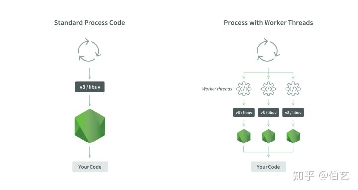

Node.js 是基于 Chrome 的 JavaScript 引擎 V8 来实现的，它的特点是可以脱离浏览器环境来执行 JavaScript。

Node.js 保持了JavaScript在浏览器中单线程的特点。它的优势是没有线程间数据同步的性能消耗也不会出现死锁的情况。

worker_threads 的出现让 Node.js 拥有**多工作线程，但**这个概念不同于Java等其它后端语言中的多线程。**多工作线程机制**

