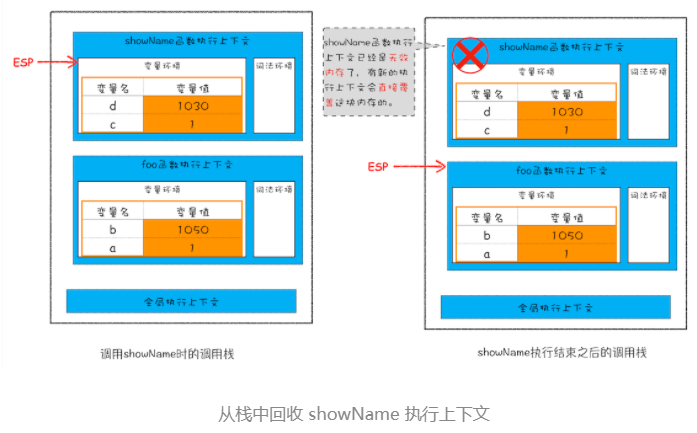

首先，按存放位置来看，V8垃圾回收可分为**调用栈**中垃圾的回收和**堆**中垃圾的回收。

#### 一、调用栈中垃圾数据的回收

​	在调用栈中有一个用于记录当前执行状态的指针ESP，如果当前的执行上下文执行完毕，ESP指针就会下移，上一个执行上下文（showname）所占用的空间就会被当做垃圾销毁。所以对于调用栈中的数据，当ESP下移的时候，上一个执行上下文的数据就会被回收销毁。

#### 二、堆中的垃圾回收

​	堆中的数据存按存活的时间主要分为两种：**新生代数据**和**老生代数据**。新生代数据由**副垃圾回收器**回收，老生代数据由 **主垃圾回收器**回收。新生代数据在经历两次回收后如果依然存活，就会被转移到老生代区域中。

1. ##### 副垃圾回收器

   ​	副垃圾回收器主要使用Scavenge算法进行回收的，它会把新生代区域划分为**对象区域**和 **空闲区域**，对对象区域中的非活动对象进行回收，每次回收完成后交换对象区域和空闲区域。其回收步骤分为以下三步：

   1. 标记活动对象和非活动对象
   2. 对非活动对象进行回收
   3. 对回收后的内存进行整理（整理因为回收产生的内存碎片）。

   副垃圾回收是在对象区域被写满的时候就会开始回收。

2. ##### 主垃圾回收器

   ​	主垃圾回收器主要使用Mark-Sweep（标记-清除算法）和Mark-Compact算法对垃圾数据进行回收，主要也是分为三步：

   1. 标记活动对象和非活动独对象
   2. 对非活动对象进行清除
   3. 使用标记-整理ESP下移之后，上一个执行上下文中指向堆中的指针失效后进行回收。