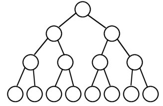
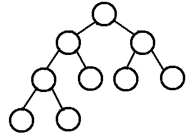

1. **满二叉树：**除了叶子节点外其他节点都有两个子节点的的二叉树

   

2. **完全二叉树：**n-1层是满二叉树，且第n层是从左往右构建出的二叉树

   

3. **搜索二叉树**：如果左子树不为空，则左子树的值都比根节点小，若右子树不为空，则右子树的所有值都比根节点大。中序遍历的出来的顺序是递增的序列。

4. **平衡二叉树：**它是一颗空树，或者树的左右子树的深度相差不超过1；

