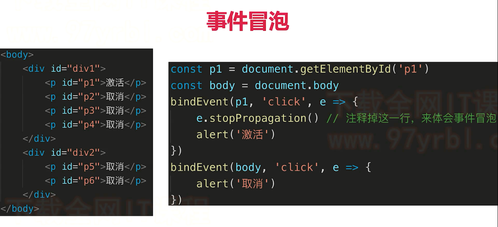

### 冒泡和捕获介绍一下

​	事件流描述的是从页面中接受事件的顺序，但有意思的是，微软（IE）和网景（Netscape）开发团队居然提出了两个截然相反的事件流概念，IE的事件流是事件冒泡流(event bubbling)，而Netscape的事件流是事件捕获流(event capturing)。
​	阻止冒泡的方法：stopPropagation();

#### 1、冒泡

​	事件冒泡是由IE开发团队提出来的，即事件开始时由最具体的元素（文档中嵌套层次最深的那个节点）接收，然后逐级向上传播。

#### 2、捕获

​	由最上一级的节点先接收事件，然后向下传播到具体的节点。

捕获和冒泡事件的顺序 - 如果一个父元素同时有一个设置了捕获的事件和普通的事件, 子元素有一个普通的事件, 事件触发的顺序是怎么样的

**按照W3C的标准，先发生捕获事件，后发生冒泡事件。所有事件的顺序是：其他元素捕获阶段事件 -> 本元素代码顺序事件 -> 其他元素冒泡阶段事件 。**