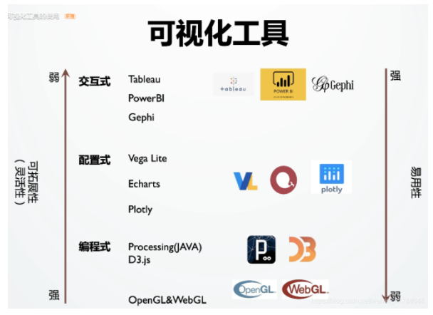

### 一、对可视化的理解

**可视化是将数据组织成易于为人所理解和认知的结构，然后用图形的方式形象地呈现出来的理论、方法和技术。**

1. 我现在的理解。可视化是人机交互这个领域的一个分支。
2. 现代计算机学科由于要解决人类社会面临的许多问题，因此与许多其他学科产生了交叉，而不仅仅只关心数学问题。其中人机交互就是设计、编程、心理学的交叉学科，并非应用数学的直接分支。正如人类还未充分地理解自己的大脑一样，人机交互中间许多因素也未规则化，因此无法建立完备的数学模型进行计算，只能采用经验性的理论或心理学假说辅助计算。所以在人机交互领域中，我们能经常看到一些很有趣的点子、工具和想法，不断探索着人类对自己和世界的认知边界。由于数据可视化也可认为是人机交互的子分支，所以该会议上也有很多可视化领域的论文发表。
3. 可视化领域的创始人,马里兰州立大学的本室内德曼教授就是这个人机交互领域的大拿。
4. 你现在这个人机交互的角度上就更能理解可视化是建立人与数据之间桥梁的这个理念了。或者可以说。数据可视化只是人机交互方法中的一种，用来建立人与机器之间，人与数据之间的桥梁。

**可视化工具**：

亚利桑那州立大学的 Ross Maciejewski （mer qian si gen）教授发表的可视化论文：用于理解和解释迁移学习过程的可视化分析框架