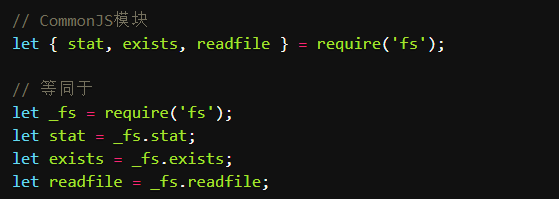
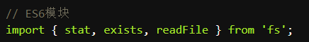

	历史上，JS一直没有模块体系，在ES6之前，最主要的是CommonJS和AMD两种。**前者用于服务器**，后者用于浏览器，ES6在语言标准的层面上实现了模块功能，使用简单，称为**浏览器和服务器通用的模块解决方案**。

#### 一、CommonJS

​	上面代码实质上就就是整体加载fs模块，生成一个_fs对象，然后在从这个对象上读取方法，**这种加载称为运行时的加载，因为只有运行的时候才会得到这个对象，导致完全没有办法在编译的时候做“静态优化”。**

**commonJS模块化的特点：**

1. 对于基本数据类型，属于复制。即会被模块缓存，如果在另外一个模块导入相同的变量也可以对该变量进行赋值。
2. 对于复杂数据类型，是浅拷贝。由于两个模块引用对象指向同一内存空间，因此对该模块的值作出修改时会影响到另一个模块。
3. 当使用require命令加载某一个模块时，就会运行整个模块的代码。
4. 当使用require命令加载同一个模块的时候，不会再执行该模块，而是取到缓存之中的值，CommonJS模块无论加载多少次，都只会在第一次加载的时候运行一次，以后在加载都是在缓存中取值返回第一次运行的结果，除非手动清除系统缓存。
5. 循环加载时，属于加载时执行。即脚本代码在require的时候就会全部执行，一旦出现某个模块被“循环加载”，就只输出已经执行的部分，还未执行的部分不会输出。

#### 二、ES6 module

​	ES6模块不是对象，而是通过export命令显示指定输出的代码，再通过import命令输入。

**ES6 module的特点：**

1. 静态化，必须定义在顶部，不能使用条件语句，自动采用严格模式。
2. treeshaking(webpack会在打包的时候忽略掉没有用的代码)和编译优化，以及在webpack3中作用域的提升。
3. 外部可以拿到实时的值而不是缓存中的值，是引用而不是拷贝。
4. es6模块中的值是属于动态只读引用。
5. 对于只读来说，就是不能修改引入变量的值，import变量是只读的，无论是基本数据类型还是复杂数据类型，当模块遇到import命令的时候。就会生成一个只读引用。等到脚本真正执行的时候，再根据这个只读引用到被加载的那个模块里面去取值。
6. 对于动态来说，原始值发生变化，import加载的值也发生变化，无论是基本数据类型还是复杂数据类型
7. 循环加载时，es6模块时动态引用的，只要两个模块之间存在某个引用，代码就能构执行。

#### 三、CommonJS和ES6 module的区别

**区别：**

1. CommonJS 模块输出的是一个值的拷贝（也就是说，一旦输出一个值，模块内部的变变化影响不到这个值），ES6 模块输出的是值的引用。
2. CommonJS 模块是运行时加载，ES6 模块是编译时输出接口。

**相同点：**

1. 都可以对对象内部的属性进行改变。

**补充（循环加载）**

​	循环加载指的是a脚本执行依赖b脚本，b脚本的执行又依赖a脚本，通常，循环加载存在强耦合，如果处理不好还可能导致递归加载，使得程序无法执行，因此应该避免，但是在复杂的大项目会有这种情况，模块加载机制必须考虑循环加载的情况。

- CommonJS 模块无论加载多少次，都只会在第一次加载时运行一次，以后再加载，就返回第一次运行的结果，除非手动清除系统缓存。
- es6模块时动态引用的，只要两个模块之间存在某个引用，代码就能构执行。
  