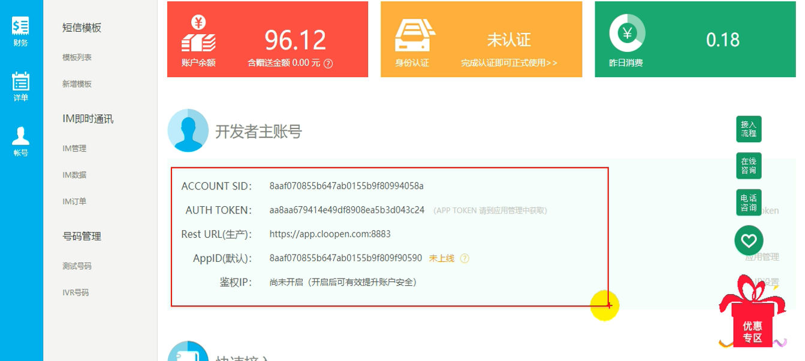
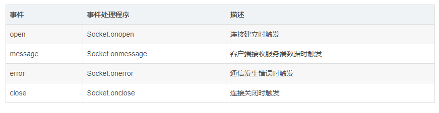
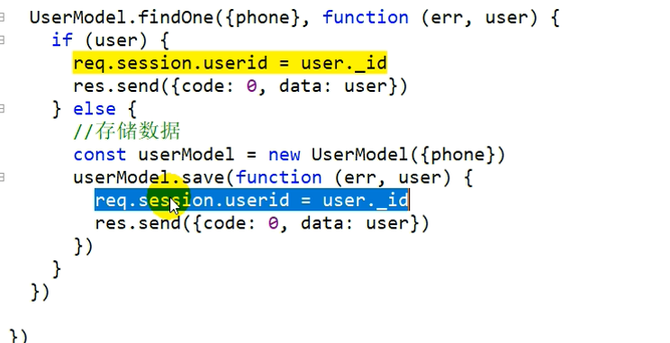
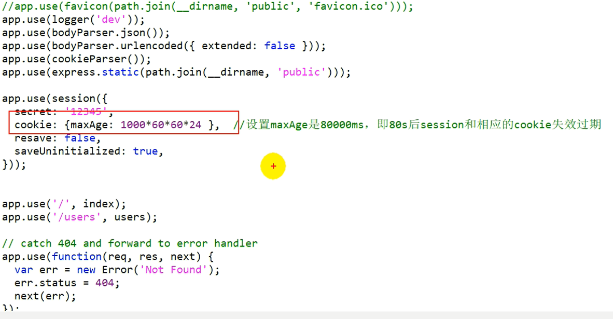

### 简历中的问题

#### <font color = 'red'>其实就是简历中给自己挖的坑</font>

### 函数式编程思想

1. "函数式编程"是一种 "编程范式" ,它属于["结构化编程"](http://en.wikipedia.org/wiki/Structured_programming)的一种，**主要思想**是把运算过程尽量写成一系列嵌套的函数调用。
2. 函数式编程的一个**特点**就是，允许把函数本身作为参数传入另一个函数，还允许返回一个函数！
3. 可以通过定义不同功能的函数：
   1. 模块化代码，实现函数功能的复用
   2. 降低代码的耦合性，有利于合作开发代码
   3. 由于函数式编程大量使用函数，减少代码的重复，使得程序较短开发较快；

### 面向对象的思想

​	面向对象的编程的主要思想是把构成问题的各个事物分解成各个对象，通过建立这些对象来描述一个事物在解决问题的过程中经历的步骤和行为：

- 对象作为程序的基本单位，将程序和数据封装其中，以提高程序的重用性，灵活性和可扩展性。
- 类是创建对象的模板，一个类可以创建多个对象。对象是类的实例化。

- 类是抽象的，不占用存储空间；而对象具体的，占用存储空间。


- 面向对象有三大特性：封装，继承，多态。

### 体育管理系统如何实现动画效果

> 问：你用requestAnimationFrame替换的是哪个东西？
>
> 答：setInterval()

requestAnimationFrame 比起 setTimeout、setInterval的优势主要有两点：

- **会把每一帧中的所有DOM操作集中起来，在一次重绘中就完成**，**并且重绘的时间间隔紧紧跟随浏览器的刷新频率**，一般来说，这个频率为每秒60帧或75帧。**显示器有固定的刷新频率（60Hz或75Hz），也就是说，每秒最多只能重绘60次或75次**
- **对于隐藏或不可见的元素，requestAnimationFrame将不会进行重绘**，这当然就意味着更少的的cpu，gpu和内存使用量。

在运行过程中，window.requestAnimationFrame() 告诉浏览器——你希望执行一个动画，并且要求浏览器在下次重绘之前调用指定的回调函数更新动画。该方法需要传入一个回调函数作为参数，该回调函数会在浏览器下一次重绘之前执行。

用法：

```js
var globalID; 
function animate() { 
  // done(); 一直运行
  globalID=requestAnimationFrame(animate); 
  // Do something animate 
} 
globalID=requestAnimationFrame(animate);//开始
cancelAnimationFrame(globalID);//结束
/*
(function animloop() {
   //记录当前时间
   nowTime = Date.now()
   // 当前时间-上次执行时间如果大于diffTime，那么执行动画，并更新上次执行时间
   if(nowTime-lastTime > diffTime){
      lastTime = nowTime
      render();
   }
   requestAnimationFrame(animloop);
})()
rAF的第一个参数会被传入一个表示时间差的参数，所以不用每次都去获取当前时间来计算差值
requestAnimationFrame不需要使用者指定循环间隔时间，浏览器会基于当前页面是否可见、CPU的负荷情况等来自行决定最佳的帧速率，从而更合理地使用CPU。
*/
```

### 你的简历上有一个项目叫体育管理项目，说一下你是怎么实现的登录注册功能、怎样判断手机号是否正确？短信验证码、发送短信后还有一个60s倒计时的问题，这个是怎么实现的？（之前字节一面的时候被问到过：页面如何判断出你已经登录然后进行自动跳转的？）

1. **如何判断手机输入是否正确**？

   使用正则表达式，实现如下：

   ```js
   //方法一：
   function checkPhone(){ 
       var phone = document.getElementById('phone').value;
       if(!(/^1[3456789]\d{9}$/.test(phone))){ 
       //if(!(/^1[3-9]\d{9}$/.test(phone))){ 
           alert("手机号码有误，请重填");  
           return false; 
       } 
   }
   //方法二：
   function checkPhone(){ 
       var phone = document.getElementById('phone').value;
       if(!(/^1(3|4|5|6|7|8|9)\d{9}$/.test(phone))){ 
           alert("手机号码有误，请重填");  
           return false; 
       } 
   }
   ```

2. **前台表单验证**

   **功能说明**：在前台只是做一个简单的验证，如手机号不正确、验证码必须是6位数字、用户名必须指定等等这些。

   ```js
   data(){
       return{
           ....
           phone:'', //手机号
           code：'', //短信验证码
           name：'', //用户名
           pwd：'', //密码
           ....
       }
   },
   methods:{
       ...
       login(){
           //前台表单验证
           if(this.loginWay){ //短信验证登录
               const {rightPhone，phone，code} = this;
               if(!this.rightPhone){
                   //手机号不正确
               }else if(!/^\d{6}$/.test(code)){
                   //验证码必须是6位数字
               }
           }else{ //密码登录
               const {name,pwd,captcha} = this;
               if(!this.name){
                  //用户名必须指定
               }else if(!this.pwd){
                  //密码必须指定
               }else if(!this.captcha){
                  //验证码必须指定
               }
           }
       }
   }
   ```

3. **前端是如何实现的点击发送短信验证码的**？

   第三方平台：“容联.云通讯”，注册登录上以后会给你一些信息，这些信息是用来发请求用的

   

   **步骤如下：**

   1. 其前端向点击**发送验证码**按钮后，会向后台服务器发送一个请求。后端有两个函数，一个用来**生成指定长度的随机数**，另一个方法用来**向指定号码发送指定验证码**，然后后台在第二个函数中根据购买的开发者信息封装好URL向平台发送请求，成功了会返回code：0，失败了会返回code：1以及提示。

4. **如何点击显示密码和不显示密码的？**

   ```js
   <input type="text" ..... v-if="showPwd">  //showPwd = true/false
   <input type="password" ..... v-else>
   ```

5. **短信验证码发送之后有一个60s的倒计时如何实现的？**

   ```vue
   <template>
       .....
   	<button>{{computeTime? `已发送(${computeTime}s)`:'获取验证码' }}</button>
   	......
   </template>
   ```

   ```js
   data(){
       return {
           computeTime:0;  //用于保存计时的时间
       }
   }
   methods:{
   	getCode(){
   		let timer = null;
   		if(!timer){
   			this.computeTime = 60;
   			timer = setInterval(()=>{
   				this.computeTime--;
                   if(this.computeTime<=0){
                       clearInterval(timer);
                   }	
   			},1000)
   		}
   	}
       //发送ajax请求（向指定手机号发送短信验证码）
       //如果做到在60s之后，即使短信验证码正确也不能成功登录
       1、在用户点击登录时判断我当前的计时器时间是否已经为0，如果为0，则直接弹出提示“验证码超时，请重新获取验证码”。
       2、在发送短信的时候将当前时间记录和发送的手机号都保存在session中，在用户发送验证码的时候校验时间是否超时，如果超时前端提示“验证码超时，请重新获取验证码”
       
   }
   ```

6. **页面是如何判断出你已经登录然后自动跳转到详细列表页面的？**

   根据后台返回的处理结果，如果成功则把用户信息存储到store中，然后跳转到个人中心页面

7. **图形验证码是怎样实现的？**

   **功能说明**：首先要有个初始化显示，然后要有个**点击切换**。

   后台有一个一次性验证码的接口：http://localhost:4000/captcha,可以获取到一个svg包含字母或数字的图片，把获取到的图片放到相应位置就行。然后给它绑定一个点击监听，一旦点击就重新发请求。

   **问题点：**路径变化才会重新发送请求，路径不变不会重发，故：'http://localhost:4000/captcha?time'+Date.now();

   ```js
   data(){
       return{
           ....
           captcha, //图形验证码
       }
   }
   ```

### 你做项目的时候有没有遇到什么难题呀？

1. 在做外卖点餐系统使用Swiper实现轮播图的时候，刚开始我把Swiper初始化的内容写在了watch中，想的是当我的数组中一旦有数据了就立马new一个swiper的实例，但是还是界面还是没有显示轮播的效果。

   > 经过在网上查阅资料发现，状态/数据改变跟状态显示是两步，第一步先去更新状态数据，第二步才会去异步更新界面，所以如果直接把Swiper写在watch里是不行的，因为它会在异步更新界面之前执行。 然后我尝试把new Swiper实例放到setTimeout中去执行，果然就能够出来轮播的效果了，但后面又觉得直接使用setTimeout不太好（因为你并不知道页面什么时候更新就直接把时间写死了），所以通过在Vue官网查看了API之后发现了一个nextTick的API使用它就可以做到在页面更新之后立即调用。

2. 在搭建天翼三期后台的时候遇到过Django版本和mongoengine 第三方插件库不兼容的问题，导致一直报错，但是报错的信息中又没有明确指出，然后又在网上搜索报错信息也没有找到问题的所在。我只能把代码都排查了一遍发现没问题，最后通过比对之前写过的一些Django的后台才发现可能是版本的问题。

3. 在使用element-UI时引入了它里面的一个upload上传的样式，但是按照它官方样例引入后，会出现两个上传按钮，一个是原生的的上传按钮，另一个是有element-UI样式的按钮，后面通过查阅资料，在样式里面加入了input[type = "file"]{ display:none !important },才解决了这个问题。原因是因为我在框架中不仅引入了element-UI，还使用了其他样式库，其他样式库中css设置了input[file] display:block

### HTML5和H5有什么区别？

1. html5是一种规范标准，不遵守的话，可能会出现一系列问题，但是h5就是可以看到的类似网页的那种炫酷界面，是对html和js和css的集合封装。h5指的是移动端应用，html5泛指web端应用。

### 你觉得小程序和H5主要的区别是啥？小程序或者H5各有什么优势？

1. 运行的环境不同。传统的H5运行环境是浏览器，而小程序（运行在特定的APP内）运行的环境并非完整的浏览器，小程序开发团队基于浏览器内核完全重构了一个内置解析器，并针对于小程序专门做了优化。小程序最后发布上线需要微信审核，微信在不更新自身软件的情况下可以将小程序更新到自身软件内。
2. 小程序的开发成本更低。就拿微信小程序来说，它为开发者提供了一套专门的开发工具，集编程、调试、开发环境和发布于一身。而H5的开发我们可能需要考虑大到前端框架、模块管理工具，小到UI库的选择、接口调试工具等。
3. 获取系统权限不同。微信小程序相对于HTML5web应用能获得更多的系统权限，比如网络通信状态、数据缓存能力等。
4. 生产环境下的运行流畅度不同。HTML5应用面对复杂的业务逻辑或者丰富的页面交互时，它的体验总是不尽人意，需要不断的对项目优化来提升用户体验。由于微信小程序运行环境独立，配合微信的解析器最终渲染出来的是原生组件的效果，自然体验上将会更进一步。

**各自的优势：**

​	H5对于小程序来说，它的优势在于它的灵活更符合web开放性的思想，我们可以自己选择开发工具、框架、管理工具、调试工具等等，可以让开发者自己开放性的探索。而小程序在为开发者提供更多便利的同时也在一定程度上限制了开发者。

​	小程序对于H5来说，它使得开发成本更低，给用户带来的性能体验更加优越，不管对开发者还是用户来说都更加的便利。

### 轮询和websocket有什么区别

1. **轮询**

   就是客户端向服务端接二连三的询问是否有新消息。

   > h5支付，当打开支付页面后不断发送请求，查询用户是否完成了支付
   > 如果没有，继续请求
   > 如果是,跳到支付成功显示页面

2. **长轮询**：

   客户端向服务器发送请求，**服务器接到请求后hold住连接，直到有新消息才返回响应信息并关闭连接**（或到了设定的超时时间关闭连接），客户端处理完响应信息后再向服务器发送新的请求。

   **优点：**减少了很多不必要的http请求次数，相比之下节约了资源。

   **缺点：**服务器hold连接会消耗资源，需要同时维护多个线程，服务器所能承载的TCP连接数是有上限的，这种轮询很容易把连接数顶满。

3. **长连接**：

   ​	HTTP1.1通过使用Connection:keep-alive进行长连接，HTTP 1.1默认进行持久连接。在一次 TCP 连接中可以完成多个 HTTP 请求，但是对每个请求仍然要单独发 header。

4. **WebSocket**:

   ​	WebSocket 协议本质上是一个基于 TCP 的协议。为了建立一个 WebSocket 连接，客户端浏览器首先要向服务器发起一个 HTTP 请求，这个请求和通常的 HTTP 请求不同，包含了一些附加头信息，其中附加头信息”Upgrade: WebSocket”表 明这是一个申请协议升级的 HTTP 请求，服务器端解析这些附加的头信息然后产生应答信息返回给客户端，客户端和服务器端的 WebSocket 连接就建立起来了，双方就可以通过这个连接通道自由的传递信息，并且这个连接会持续存在直到客户端或者服务器端的某一方主动的关闭连接。

   ```js
   var Socket = new WebSocket(url, [protocol] );
   ```

   

   ```html
   <!DOCTYPE HTML>
   <html>
      <head>
      <meta charset="utf-8">
         <script type="text/javascript">
            function WebSocketTest(){
               if ("WebSocket" in window){
                  alert("您的浏览器支持 WebSocket!");
                  // 打开一个 web socket
                  var ws = new WebSocket("ws://localhost:9998/echo");
                  ws.onopen = function(){
                     // Web Socket 已连接上，使用 send() 方法发送数据
                     ws.send("发送数据");
                     alert("数据发送中...");
                  }; 
                  ws.onmessage = function (evt) { 
                     var received_msg = evt.data;
                     alert("数据已接收...");
                  }; 
                  ws.onclose = function(){ 
                     // 关闭 websocket
                     alert("连接已关闭..."); 
                  };
               }else{
                  // 浏览器不支持 WebSocket
                  alert("您的浏览器不支持 WebSocket!");
               }
            }
         </script>  
      </head>
      <body>
         <div id="sse">
            <a href="javascript:WebSocketTest()">运行 WebSocket</a>
         </div> 
      </body>
   </html>
   ```

兼容性：短轮询>长轮询>长连接>WebSocket

性能：WebSocket>长连接>长轮询>短轮询

### 写登录的时候是如何和后端对接的，登录状态到底是用data中的数据保存还是使用Cookie保存。

当前端所有的表单验证通过了之后：

1. 前端向后端发送登录请求：手机验证码登录（电话号、验证码）/密码登录（用户名、密码、验证码）

2. 根据返回结果做处理，如果返回result.code:0（代表验证通过），把返回的result.data中的数据赋值给user，把user保存到Vuex的state中。跳转到个人中心页面。

3. 在服务器给我们返回登录成功标志和数据的同时，会把用户信息存到session中。原本session在浏览器关闭只有就结束会话了再想访问时看不到以前的会话的。但是在session中有一个特别的Cookie（**叫做session_id的Cookie，用来维护内session的Cookie**），在这个Cookie中指定了max-age：比如说是一天，这样session就可以维持一天，让我一天以内免登录。

   

   

4. 根据会话来获取用户信息，以此实现用户自动登录状态。由于我们后端维护了一个持久的session ，所以后端还有一个请求session中用户信息的接口，在前端当我们打开页面后会请求这个接口，如果在缓存的时间内的话就可以得到用户的信息，把它存到Vuex中的state中。

**浏览器通过每次访问服务器的时候传输SessionID就能一直找到保持连接状态。SessionID的传送，有两种方案，一个是依赖Cookie传输SessionID。第二是用URL重写的方式，主要是因为有的用户禁用Cookie或者嵌入式浏览器一般不支持Cookie，URL重写就是把SessionID通过访问的URL上传给服务器。**